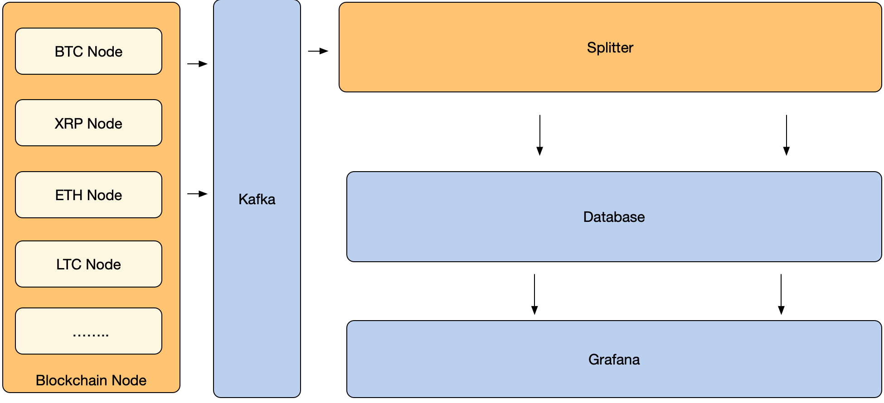

# bds-eth
## 介绍
bds-etc 是开源项目区块链数据服务（BDS）的其中一个独立模块 - 提供全节点服务。

*bds-etc* 基于 [etclabscore/go-ethereum](https://github.com/etclabscore/go-ethereum) 的 v6.0.8 版本进行二次开发，支持直接将新增的区块数据往消息中间件服务 kafka 发送，方便上游的服务来订阅消费。

## 架构


## 环境部署 
### 安装 ETC
#### 环境初始化
[build-unix](./doc/build-unix.md)

#### 运行步骤

1.编译

 ```
   make cmd/geth
 ```
   或者, 构建整套工具:
   
 ```
   make build
 ```
 

2.运行全节点，并支持向 kafka 发送消息

```
  geth --rpc --datadir <data directory> --rpcapi admin,db,eth,debug,miner,net,shh,txpool,personal,web3 --cache 4096 --rpc-addr=<rpcaddress> --kafka.endpoint <kafka rest proxy, default "http://localhost:8082/topics/etc">
```

### 安装 confluent 和 kafka
#### 安装kafka
参见 [kafka 官网](http://kafka.apache.org/quickstart)

修改 config/server.properties 文件

* message.max.bytes=1048576000

#### 安装 confluent
参见 [confluent](https://docs.confluent.io/current/installation/installing_cp/zip-tar.html#prod-kafka-cli-install)

解压缩 confluent 安装包并运行Confluent Rest Proxy

修改 /etc/kafka-rest/kafka-rest.properties 文件

* max.request.size = 1048576000
* buffer.memory = 1048576000
* send.buffer.bytes = 1048576000

### 安装 BDS
参见[BDS](https://github.com/jdcloud-bds/bds)

### 数据库
我们现在支持 SQL server 和 PostgreSQL 两种数据库，您可以选择其中一种作为数据存储方法。

#### SQL Server
购买 [云数据库 SQL Server](https://www.jdcloud.com/cn/products/jcs-for-sql-server)

#### PostgreSQL 
购买 [云数据库 PostgreSQL](https://www.jdcloud.com/cn/products/jcs-for-postgresql)

### 安装 Grafana 
参见 [Grafana 官网](https://grafana.com/)

## 新增功能

1. 增加了向 kafka 发送消息的新功能（每次一个新块被全节点同步时，该块的数据将以定制的数据结构被发送到 kafka 中）
2. sendblock 和 sendbatchblock 是新添加的两个 RPC 接口，用于触发全节点发送特定块的数据。

### 源代码修改历史记录
[bds-etc](./CHANGE_HISTORY.md)

## 贡献
[贡献指南](./CONTRIBUTING.md)

## 开源许可 
[Apache License 2.0](./LICENSE)

## 项目展示
[区块链数据服务](https://bds.jdcloud.com/)

